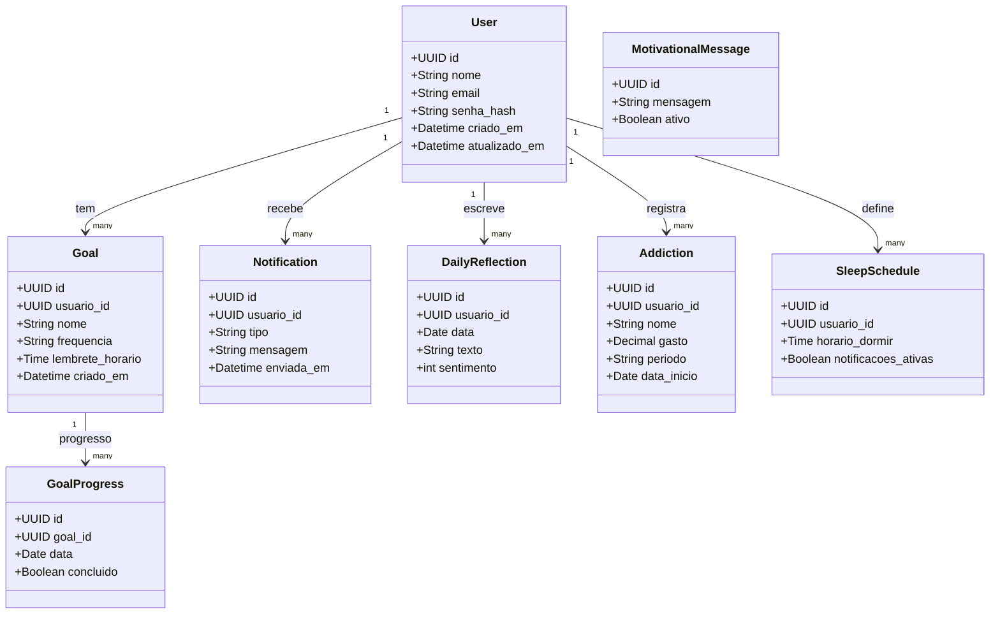

# Entidades e Relacionamentos
## 1. Usuário (users)
| Campo          | Tipo          | Restrições       |
| -------------- | ------------- | ---------------- |
| id             | UUID / SERIAL | PK               |
| nome           | VARCHAR(100)  | NOT NULL         |
| email          | VARCHAR(100)  | UNIQUE, NOT NULL |
| senha\_hash    | TEXT          | NOT NULL         |
| criado\_em     | TIMESTAMP     | DEFAULT NOW()    |
| atualizado\_em | TIMESTAMP     |                  |

## 2. Meta de Hábito (goals)
| Campo             | Tipo          | Restrições                      |
| ----------------- | ------------- | ------------------------------- |
| id                | UUID / SERIAL | PK                              |
| usuario\_id       | UUID          | FK → users(id), NOT NULL        |
| nome              | VARCHAR(100)  | NOT NULL                        |
| frequencia        | VARCHAR(20)   | ('diária', 'semanal'), NOT NULL |
| lembrete\_horario | TIME          | OPCIONAL                        |
| criado\_em        | TIMESTAMP     | DEFAULT NOW()                   |

## 3. Progresso da Meta (goal_progress)
| Campo     | Tipo          | Restrições               |
| --------- | ------------- | ------------------------ |
| id        | UUID / SERIAL | PK                       |
| goal\_id  | UUID          | FK → goals(id), NOT NULL |
| data      | DATE          | NOT NULL                 |
| concluido | BOOLEAN       | DEFAULT FALSE            |

## 4. Notificações Enviadas (notifications)
| Campo       | Tipo          | Restrições                         |
| ----------- | ------------- | ---------------------------------- |
| id          | UUID / SERIAL | PK                                 |
| usuario\_id | UUID          | FK → users(id), NOT NULL           |
| tipo        | VARCHAR(50)   | Ex: 'lembrete\_meta', 'sono', etc. |
| mensagem    | TEXT          | NOT NULL                           |
| enviada\_em | TIMESTAMP     | DEFAULT NOW()                      |

## 5. Reflexões Diárias (daily_reflections)
| Campo       | Tipo          | Restrições               |
| ----------- | ------------- | ------------------------ |
| id          | UUID / SERIAL | PK                       |
| usuario\_id | UUID          | FK → users(id), NOT NULL |
| data        | DATE          | DEFAULT CURRENT\_DATE    |
| texto       | TEXT          | OPCIONAL                 |
| sentimento  | INT           | 1 a 5 (nível emocional)  |

## 6. Vícios (addictions)
| Campo        | Tipo          | Restrições                      |
| ------------ | ------------- | ------------------------------- |
| id           | UUID / SERIAL | PK                              |
| usuario\_id  | UUID          | FK → users(id), NOT NULL        |
| nome         | VARCHAR(100)  | NOT NULL                        |
| gasto        | NUMERIC(10,2) | OPCIONAL                        |
| periodo      | VARCHAR(20)   | ('diário', 'semanal', 'mensal') |
| data\_inicio | DATE          | NOT NULL                        |

## 7. Sono (sleep_schedule)
| Campo                | Tipo          | Restrições               |
| -------------------- | ------------- | ------------------------ |
| id                   | UUID / SERIAL | PK                       |
| usuario\_id          | UUID          | FK → users(id), NOT NULL |
| horario\_dormir      | TIME          | NOT NULL                 |
| notificacoes\_ativas | BOOLEAN       | DEFAULT TRUE             |

## 8. Mensagens Motivacionais (motivational_messages)
| Campo    | Tipo          | Restrições   |
| -------- | ------------- | ------------ |
| id       | UUID / SERIAL | PK           |
| mensagem | TEXT          | NOT NULL     |
| ativo    | BOOLEAN       | DEFAULT TRUE |

## Relacionamentos
- Um usuário pode ter várias metas, reflexões, vícios, notificações, e registros de sono.
- Uma meta tem múltiplos registros de progresso.
- As mensagens motivacionais podem ser sorteadas e exibidas sem ligação direta com usuários (mas podem ser registradas, se necessário).
